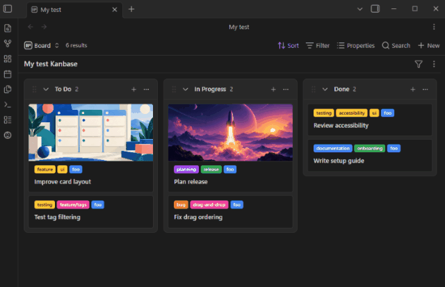

<p align="center">
  <picture>
    <source media="(prefers-color-scheme: dark)" srcset="logo-dark.svg">
    
  </picture>
</p>

# Kanbase

**Kanbase** is yet another Kanban board view for [Obsidian Bases](https://obsidian.md). It lets you organize your notes into visual columns based on any property in their frontmatter, providing a seamless drag-and-drop experience for managing tasks and structured data.

Kanbase is a fork of Michael DeRazon's [original plugin](https://github.com/mderazon/obsidian-base-board). It has since diverged considerably from Michael's version, enough to justify creating a separate plugin.



## Key Features

- **Property-Based Columns**: Group notes into columns using any frontmatter property.
- **Drag, Drop & Bulk Move**: Reorder cards, move them between columns, or select and move multiple cards together.
- **Column Management**: Add, rename, reorder, color, collapse, and remove columns directly from the board, with optional work-in-progress limits.
- **Rich, Customizable Cards**: Display selected properties, cover images, configurable titles, adjustable title size, and tags above or below the title.
- **Advanced Tag Filtering**: See per-tag card counts and cycle tags between included, excluded, and inactive states. The filter bar can be hidden per board.
- **Base-Aware Tag Display**: Optionally hide tags already required by the underlying Base filters.
- **Flexible Card Opening**: Open notes in the active pane, a new tab, a split, or a floating editing modal.
- **Optional Hover Previews**: Enable native Obsidian previews for cards using the **Page preview** core plugin.
- **Inline Editing**: Rename cards and columns and edit card tags without leaving the board.
- **Quick Card Creation**: Create notes in a column using the configured folder, template, default properties, and top or bottom placement.
- **Markdown-Native Data**: Card moves and edits update ordinary Markdown files and frontmatter; Kanbase does not maintain a separate task database.

## Usage

Open the **Command palette** (`Ctrl/Cmd + P`) and run **"Kanbase: Create new board"**. Enter a name, choose a folder, and the plugin will scaffold everything for you — a `.base` file, a tasks folder, and sample task notes. The board opens automatically.

### Card Navigation & Selection

By default, card interaction respects native Obsidian conventions:

- **Click:** Open the card's note in the active tab / pane.
- **Ctrl/Cmd + Click:** Open the note in a new tab.
- **Ctrl/Cmd + Alt + Click** (or **Cmd + Option + Click** on macOS): Open the note to the side in a split pane.
- **Alt / Option + Click:** Toggle selection of a card (for bulk actions or dragging).
- **Shift + Click:** Select a range of cards.

You can customize the default click behavior (e.g. to always open in a floating modal, split pane, or new tab) via the board toolbar under the view options menu.

### Card Ordering

Kanbase uses manual drag order so cards remain exactly where you place them. This order is stored in each note's `kanban_order` property and overrides the native Bases **Sort by** setting.

### Default Card Properties (`newItemProperties`)

You can set board-specific default frontmatter properties for new cards created from **"+ Add card"** using `newItemProperties` in your `.base` file:

```yaml
views:
  - type: kanbase
    name: Frontend Board
    newItemFolder: Tasks
    newItemTemplate: Templates/task.md
    newItemProperties:
      team: frontend
      category: alpha
```

This ensures new cards automatically receive required frontmatter fields, keeping them visible on filtered boards.

## Installation

### From Obsidian Community Plugins

Search for **Kanbase** in the Obsidian Community Plugins browser and click
**Install**, or view the plugin directly in the
[Obsidian Community Plugins directory](https://community.obsidian.md/plugins/kanbase).

### Using BRAT

Kanbase can also be installed manually through
[BRAT](https://github.com/TfTHacker/obsidian42-brat):

1. Install and enable BRAT from Obsidian's Community Plugins browser.
2. Open **Settings → BRAT → Add Beta Plugin**.
3. Enter `luciopaiva/obsidian-kanbase` and select **Add Plugin**.
4. Enable **Kanbase** under **Settings → Community plugins**.

## Development

See the [development guide](DEVELOPMENT.md) for setup, validation, and E2E test
instructions.

## Attribution

Kanbase is derived from [Base Board](https://github.com/mderazon/obsidian-base-board), originally created by [Michael DeRazon](https://github.com/mderazon).

## License

This plugin is licensed under the [MIT License](LICENSE).
